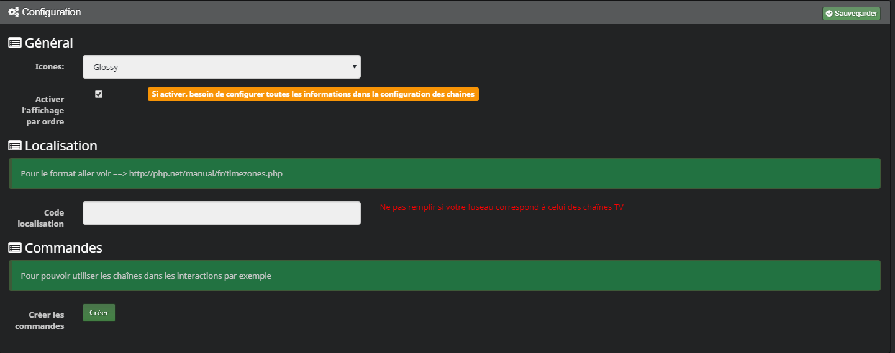
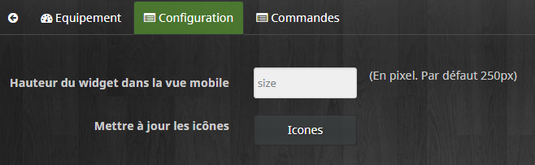
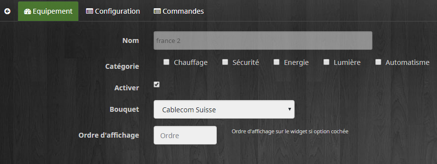
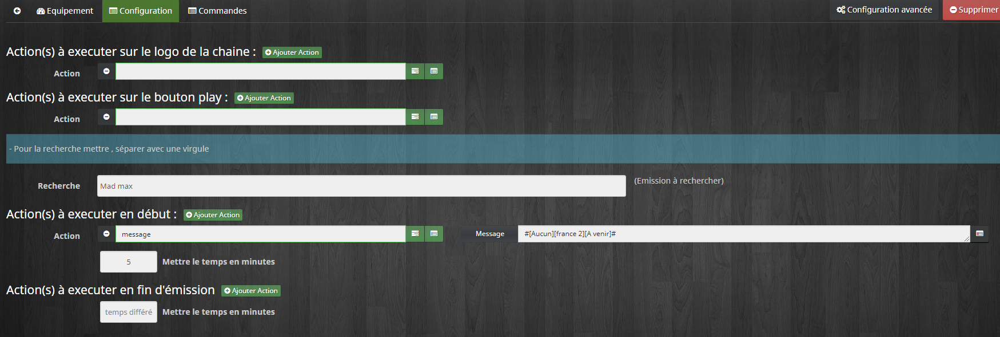
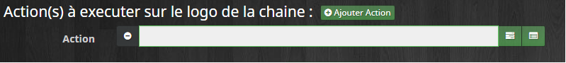
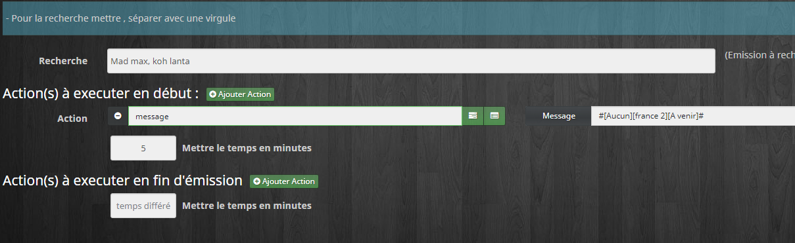
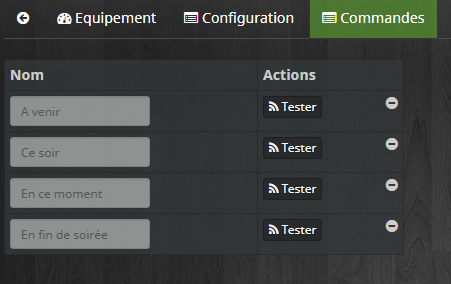
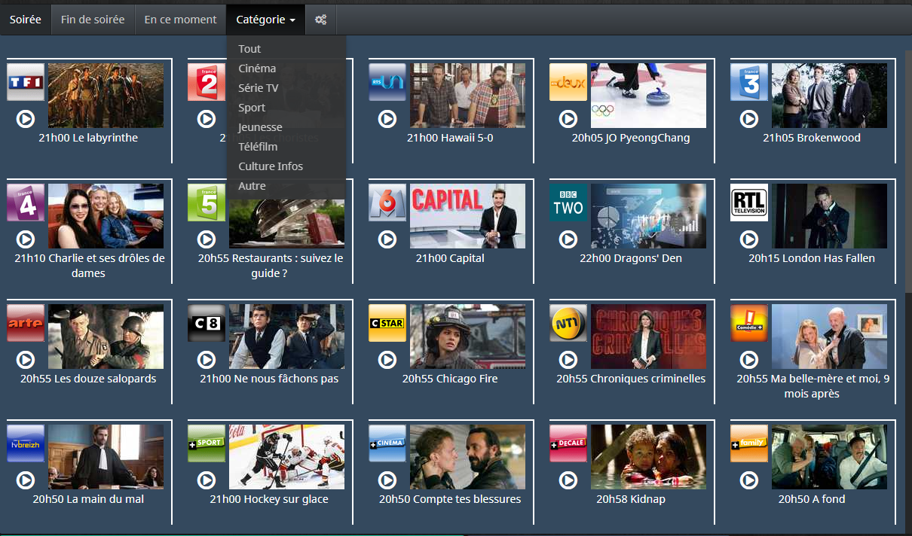
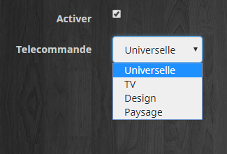
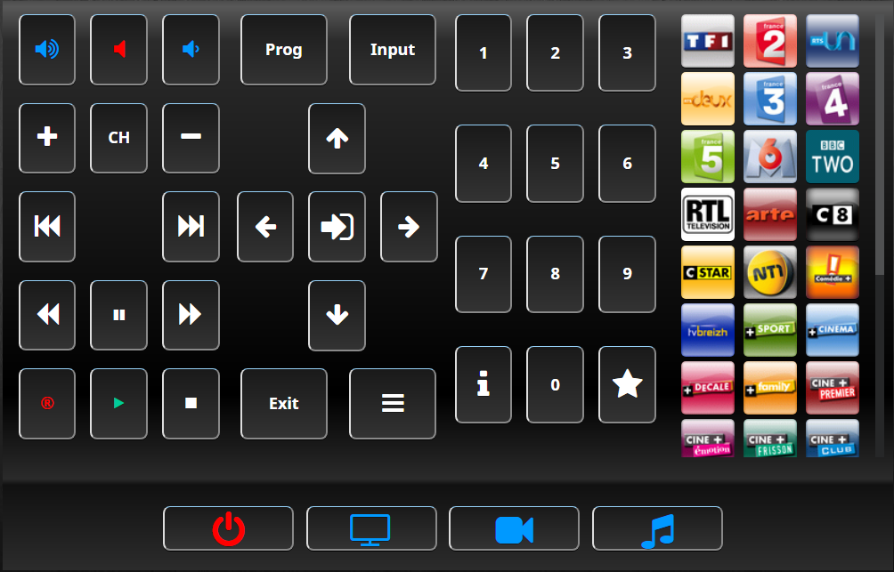

> **UPDATE**
>
> Telejee passe en version 2 ce qui otpimise fortement le plugin. Vos configurations ne seront pas perdues.
> 
> Aprés avoir effectué la mise à jour , si ce n'est déjà fait , il faut aller dans la configuration de chaque chaîne et choisir le bouquet. Vous n'aurez qu'à faire ça qu'une fois.
>
> Le widget est revu complétement et fini la configuration des colonnes. Si la taille ne joue pas  sur le dashboard/design, il faut redimensionner le widget en mode modification.
>
> Bien lire le changelog car il y a des nouveautés (Widget , commandes , télécommandes...).
>
> En cas de problème n'hésitez pas à me le signaler sur le forum [cliquer ici](https://www.jeedom.com/forum/viewtopic.php?f=142&t=6111)
>
> Merci pour votre compréhension

Description 
===

Ce plugin permet de récupérer le programme des chaînes TV de différents bouquets satellites et d'interagir avec votre domotique. Vous pouvez changez de chaine , lancer des scénes pour vous mettre dans des conditions optimales, etc..

Installation
===

* Télécharger le Plugin Telejee sur le market.

* Activer le.Puis choissisez le type d'icônes et fuseau horaire si besoin.Attendez de créer des chaînes avant de créer des commandes. Pour l'ordre des chaines , lire le paragraphe sur le widget.

* Puis aller dans Plugins/Multimedia/Telejee

Les chaines TV
===

Configuration des chaînes
---

> **IMPORTANT**

> Il faut impérativement Cliquer sur "Activer les chaines" avant d'ajouter des chaînes. Cela créer un seul équipement et c'est celui-ci que vous devez configurer pour que le widget soit visible sur le dashboard.Pour cela survoler la partie gauche de l'écran avec la souris 

 

* Une icone de réglage est apparue   En cliquant dessus vous vous retrouver sur la configuration de l'équipement. C'est ici que vous configurez l'objet pour voir le widget sur le dashboard.

* En cliquant sur l'onglet Configuration , vous pouvez définir la taille du widget pour la vue mobile et recharger les icônes si vous changez de pack.

* Ensuite ajouter les chaînes que vous souhaitez en cliquant sur  . 
* Choisissez votre bouquet.

* Vous pouvez ensuite choisir une ou plusieurs chaînes.Faites une par une si vous voulez un ordre précis.La barre de recherche vous permet d'accéder rapidement à une chaîne précise.

* Sauver pour avoir quelque chose du style :

* En cliquant sur une chaîne vous pouvez la configurer

** Bouquet** : Le bouquet actuel

**Ordre d'affichage** : Actif si l'option est cichée dans la configuration générale du plugin

Les actions
---

Vous pouvez  définir des actions qui se déclencheront lorsqu'un clic est effectué sur un logo de chaine OU sur la petite icône "play".Vous pouvez ajouter autant d’actions que vous voulez et gérer les scénarios. Cliquer sur configuration

 

* Les actions sur le logo ou le bouton play

1. Le bouton de gauche permet de chosir un mot clé
2. Le bouton de droite permet de choisir une commande
3. Vous pouvez ajouter autant d'actions que vous le souhaitez en cliquant sur ajouter action

La recherche d'émission
---

1. Pour les actions à éxécuter au début vous pouvez ajouter un temps différé en minutes. Dans ce cas les actions se lanceront x minutes avant le début l'émission.
2. Pour les actions à éxécuter en fin vous pouvez ajouter un temps différé en minutes. Dans ce cas les actions se lanceront x minutes aprés la fin de  l'émission.

Les commandes
---

1. **A venir** : Commande qui transmet le prochain programme
2. **Ce soir** : Commande qui transmet le programme de la soirée (Prime)
3. **En ce moment** : Commande qui transmet le programme en cours
4. **En fin de soirée** : Commande qui transmet le prochain programme de fin de soirée

Le widget
---

> **IMPORTANT**
>
> La première fois vous devrez définir la taille en vous mettant en mode modification sur le dashboard ( Petit crayon en haut à droite du dashboard)
>
> Vous pouvez ensuite utiliser la configuration avancée pour customiser le widget

 

 

1. Le menu permet de connaître les programmes selon le moment de la journée. Le menu déroulant de choisir les programmes par genre
2. Les actions définies peuvent être éxécutées sur le widget en cliquant sur l'icône de la chaîne ou l'icône "play"
3. Un clic sur l'image permet de visionner les détails du programme.

* La vue mobile est identique à celle sur le dashboard . Idem pour la vue design.

Les commandes
--- 

* Pour créer les commandes pour connaître les programmes du soir et du moment de chaque chaine.

* Aller dans la configuration générale du plugin et cliquer sur le bouton créer. il faut attendre max 10 minutes pour que les programmes du moment se mettent à jour.

* Exemple d'utilisation dans une interaction (idem dans les scénarios)

Les télécommandes
===

* Cliquer sur   et nommer votre télécommande

* Dans l'équipement vous pourrez choisir une télécommande 

L'universelle 
---

La Télécommande TV
--- 

La Design
---

La Paysage
---

> **IMPORTANT**
>
> Pour la paysage il faut définir une largeur et une hauteur de widget

Les commandes
---

* Aller dans les commandes de la télécommande

Vous pouvez ainsi choisir une action à éxécuter pour chaque touche en cliquant sur le  image:tel15.png[] 

* Pour la paysage , il y a la Possibilité de choisir trois actions par commandes qui réagiront selon le mode sélectionné ( Tv,Vidéo ou Audio)

